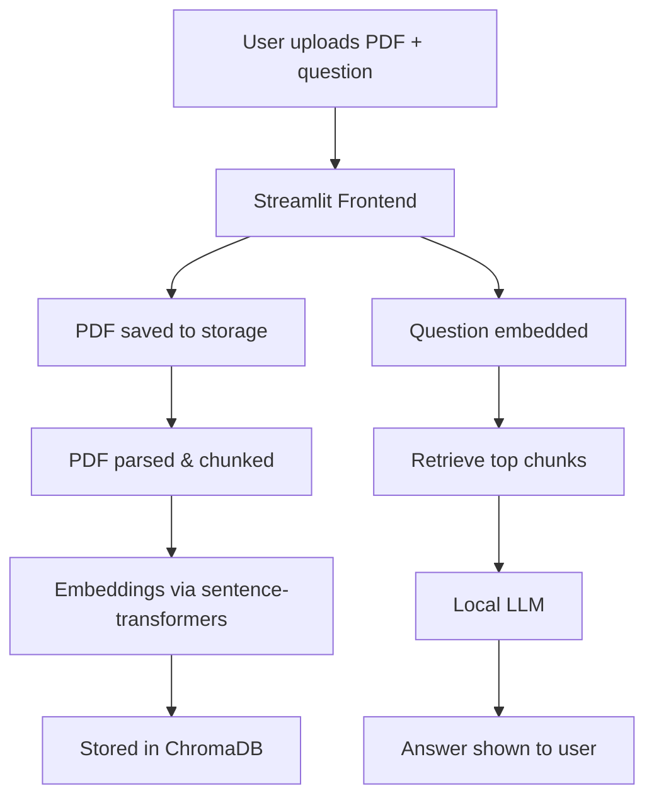

```mermaid
graph TD
    A[User uploads PDF + question]
    B[Streamlit Frontend]
    C[PDF saved to storage]
    D[PDF parsed & chunked]
    E[Embeddings via sentence-transformers]
    F[Stored in ChromaDB]
    G[Question embedded]
    H[Retrieve top chunks]
    I[Local LLM]
    J[Answer shown to user]

    A --> B
    B --> C
    C --> D
    D --> E
    E --> F
    B --> G
    G --> H
    H --> I
    I --> J
```